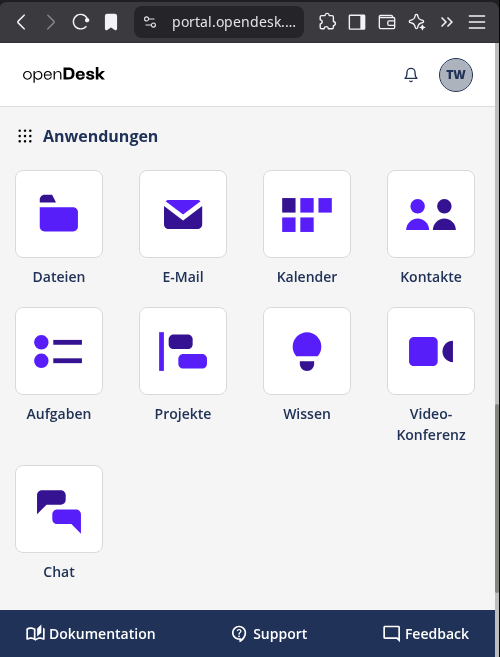
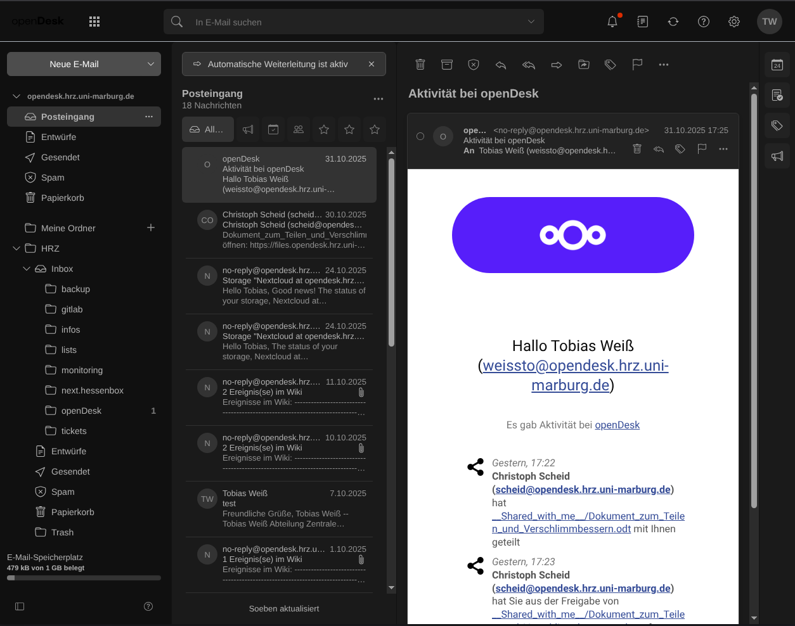
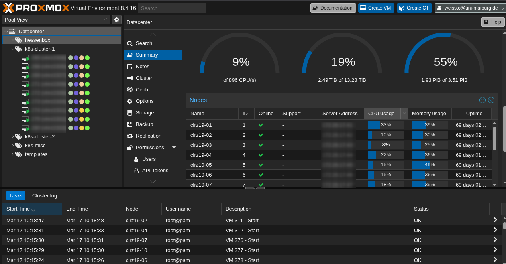
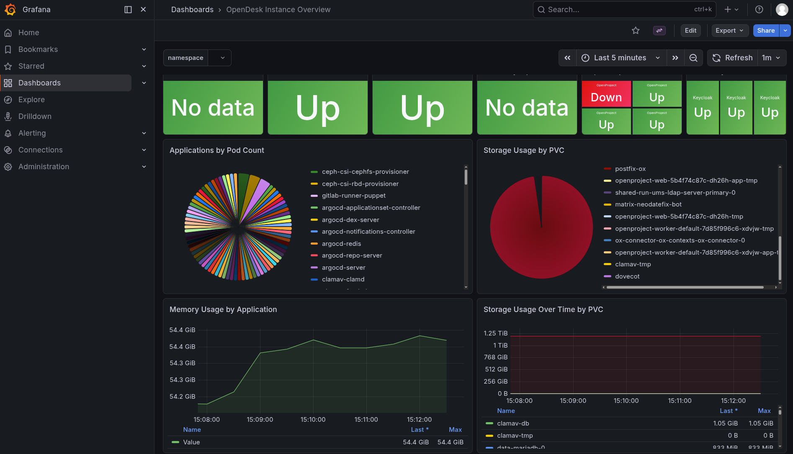

# openDesk: Komfortabel und Souverän?

LinuxTag 2026 | 28.03.2026

Tobias Weiß | HRZ Zentrale Systeme | Universität Marburg

---

# Digitale Souveränität — Die vier Säulen

- **Infrastruktur-Souveränität** 🖥️
  Server und Netzwerke selbst betreiben
- **Daten-Souveränität** 💾
  Kontrolle über Datenspeicherung und Zugriff
- **Software-Souveränität** 💻
  Open-Source-Software ohne proprietäre Bindungen
- **Betriebs-Souveränität** 🔧
  Vollständige Kontrolle über Updates und Wartung

---

# Was ist openDesk?

- **Open-Source-Alternative** zu M365 & Google Workspace 🐧
- **BSI-zertifiziert** (deutsche Souveränität) 📜
- **Cloud-Native:** Kubernetes-basierter Arbeitsplatz ☁️
- **Modulare Komponenten:**
  - Chat, Dateien, Wiki, Projektmanagement
  - E-Mail, Diagramme, Weboffice, Video
- **Self-Hosted** im eigenen Rechenzentrum 🖥️

---

# Komponentenübersicht

| Komponente | Software |
|------------|----------|
| Chat 💬 | Element / Synapse |
| Dateien ☁️ | Nextcloud |
| Wiki 📖 | XWiki |
| Projekt ✅ | OpenProject |
| E-Mail ✉️ | OX App Suite |
| Diagramme 📊 | CryptPad |
| Weboffice 📄 | Collabora |
| Video 📹 | Jitsi |

---

# openDesk Projekt-Statistiken

**Entwicklung** 🔀              | **Community** 👥
--------------------------------|---------------------------
Start: Juli 2023                | Contributors: ~ 70
Laufzeit: ~ 2,5 Jahre           | Organisationen: ~ 27
Commits: ~ 1.500                |
Releases: ~ 150                 |

**OpenCode.de** 🛡️              | **Supply Chain** 🔒
BMI-geförderte Plattform        | Signierte Container-Images
Souveräne Cloud-Infrastruktur   | SBOM für alle Komponenten

---

# OX App Suite — E-Mail und Kommunikation



---

# Infrastrukturübersicht

| Metrik | Wert |
|--------|------|
| **Knoten** | 9 (3 Control-Plane + 6 Worker) |
| **Distribution** | K3s v1.32.3 |
| **OS** | Debian 12 |
| **CPU (Minimum)** | 16 Kerne |
| **RAM (Minimum)** | 64 GB |
| **Speicher** | 4+ TB Ceph |

---

# Virtualisierung mit Proxmox



---

# Helmfile & HRZ-Environment

```bash
# Deployment mit Helmfile
helmfile apply -e hrz
```

- **Helmfile-Orchestrierung** ⚓
  - Deklarative Konfiguration in `helmfile_generic.yaml.gotmpl`
  - Umgebungsspezifische Overrides in `environments/hrz/`
  - Automatisches Sicherung der Abhängigkeiten
- **HRZ-Environment erstellt** 🖥️
  - Kopie von `staging` mit Anpassungen
  - Uni Marburg-spezifische Konfiguration
  - Testsystem für Pilotbetrieb

---

# Lokale Chart-Entwicklung

```bash
# Charts lokal klonen/pullen
python3 dev/charts-local.py --match intercom
python3 dev/charts-local.py --revert
```

- **Lokale Chart-Entwicklung & Testing** 💻
- **Clone/pull in charts-\<branch\>/** ⬇️
- **Helmfile-Referenzen auf lokale Paths** 📄
- **Backup & Revert mit --revert** ↩️

---

# User-Import: Provisioning

- **UDM REST API** für User-Import 👤
  - Import aus CSV/ODS-Templates
  - Unterstützung von LDAP-Gruppen, Passwörtern
  - OX Contexts für Groupware-Module 🔄
- **Account Linking Extension** 🔗
  - SAML-Identity Provider Verknüpfung
  - Keycloak API für Identity linking
  - Automatische Erstverknüpfung bei Import
- **Demo-Modus** 🖼️
  - Zufällige Test-Accounts generieren
  - Profilbilder: thispersondoesnotexist.com
  - Umfangreiche Demo-Daten

---

# User-Import: Deprovisioning

**Zwei-Phasen Deprovisioning-Workflow:**

- **Phase 1: Disable User**
  - IAM API → UCS Disable → Timestamp in Description
  - Keycloak: SAML entfernen + Gruppen auflösen
- **Phase 2: Delete User**
  - Grace Period (6 Monate) → Permanent löschen
  - Output: `deprovisioned-*`, `deleted-*`

---

# 🎓 Introducing openDesk Edu

- **Extension of openDesk CE** for educational institutions 🏫
- **What we added:**
  - Learning Management Systems (ILIAS, Moodle)
  - Video conferencing for teaching (BigBlueButton)
  - Alternative file sync (OpenCloud)
- **All integrated with Keycloak SSO** 🔐
- **Deploy everything with `helmfile apply`** ⚡

**GitHub:** [github.com/tobias-weiss-ai-xr/opendesk-edu](https://github.com/tobias-weiss-ai-xr/opendesk-edu)

---

# 📚 Educational Components

| Komponente | Status | Beschreibung |
|------------|--------|--------------|
| 📖 ILIAS | ✅ Stable | LMS mit SAML SSO — Kurse, SCORM, Tests |
| 📖 Moodle | 🔄 Beta | LMS mit Shibboleth — Plugins, Gradebook |
| 🎥 BigBlueButton | 🔄 Beta | Videokonferenzen für Lehre — Recording, Whiteboard |
| ☁️ OpenCloud | 🔄 Beta | CS3-basierter Dateisync — Alternative zu Nextcloud |

---

# 🚀 Quick Start - Deploy in 3 Steps

```bash
# 1. Clone the repository
git clone https://github.com/tobias-weiss-ai-xr/opendesk-edu.git
cd opendesk-edu

# 2. Configure your environment
# Edit helmfile/environments/default/global.yaml.gotmpl
# Set your domain, mail domain, and image registry

# 3. Deploy
helmfile -e default apply
```

📖 Full documentation: [docs/getting-started.md](https://github.com/tobias-weiss-ai-xr/opendesk-edu/blob/main/docs/getting-started.md)

---

# Netzwerkkonfiguration

- **Ingress-Controller:**
  - haproxy-ingress (Default)
  - nginx-ingress (veraltet)
- **Traefik als Reverse Proxy** 🔄
  - HTTP/HTTPS-Terminierung, LoadBalancer (MetalLB)
- **Hinweis:** ingress-nginx Retirement ⚠️
  - Migration zu haproxy bereits durchgeführt

---

# Grafana Dashboard



---

# Update-Prozess

```bash
# Neueste Releases laden
git checkout -b myrelease upstream/tags/v1.12.2
git pull

# Aenderungen pruefen
helmfile diff -e staging

# Updates anwenden
helmfile apply -e staging

# Bei Bedarf zurueckrollen
helmfile rollback -e staging
```

- **Kontrollierte Updates via Helmfile** 🔄
- **Einfache Rollback-Möglichkeit** ↩️

---

# HRZ-Upgrade: Ingress-Migration

- **Migration:** nginx → haproxy-ingress 🔀
  - v1.11.2 → v1.13.x (uniapps branch)
  - Alle Ingresses migriert zu haproxy ✅
- **Ingress Classes:**
  - `ingressClassName: haproxy`
  - nginx vollständig deprecatet
- **Konfiguration:**
  - `replicaCount: 2`, LoadBalancer
  - `tune.bufsize: 65536`, `tune.http.maxhdr: 256`

---

# HRZ-Upgrade: Dual Backup

- **Ziele:** Redundante Backup-Speicher 🗄️
- **Strategie:** S3-kompatibel mit restic-Backend 🔄
  - Primary: `s3.example.org:9000/backup-primary`
  - Secondary: `s3-backup.example.org:9000/backup-secondary`
- **Schedule:** Täglich 00:42, Check wöchentlich, Prune sonntags ⏰
- **Retention:** 14 Daily, Keep Last 5 📦

---

# Institutionelle Hürden

- **Rechtsabteilung** ⚖️
  - DSGVO, AVV-Verträge, Lizenz-Compliance
- **Personalrat** 👥
  - Dienstvereinbarung, Mitbestimmung bei IT-Systemen
- **Verwaltung** 🏢
  - Microsoft-Präferenzen, Formatkompatibilität
- **Erforderliche Dokumente** 📄
  - DSFA, TCO-Kalkulation

---

# Nächste Schritte & Empfehlungen

1. Pilotbetrieb starten ▶️
2. Gestaffelter Rollout (10 → 100 → 1000 Benutzer) 👥
3. Klare Trennung von Produktionssystemen 🔗
4. Evaluierung: Anwendungsfälle nach Souveränitätsanforderung kategorisieren ✅
5. Budget für Betriebsteam einplanen (nicht nur Implementierung) 💰

---

# 🤝 Call to Action

**Help us build openDesk Edu for universities!**

- ⭐ **Star the repo:** [github.com/tobias-weiss-ai-xr/opendesk-edu](https://github.com/tobias-weiss-ai-xr/opendesk-edu)
- 🧪 **Test locally:** Deploy with helmfile and report issues
- 🐛 **Report bugs:** Open issues for problems or feature requests
- 💻 **Contribute:** PRs welcome — see CONTRIBUTING.md

**Let's make sovereign educational software together!** 🎓

---

# Technische Ressourcen

- **openDesk:** [docs.opendesk.eu](https://docs.opendesk.eu) ·
  [Deployment-Guide](https://gitlab.opencode.de/bmi/opendesk/deployment/opendesk/-/blob/main/docs/getting-started.md) ·
  [User-Import](https://gitlab.opencode.de/bmi/opendesk/components/platform-development/images/user-import)
- **openDesk Edu:** [github.com/tobias-weiss-ai-xr/opendesk-edu](https://github.com/tobias-weiss-ai-xr/opendesk-edu) · Educational extension for universities
- **DFN-AAI:** [dfn.de/dienste/dfnaai/](https://www.dfn.de/dienste/dfnaai/)
- **K3s:** [docs.k3s.io](https://docs.k3s.io/)
- **Helmfile:** [helmfile.readthedocs.io](https://helmfile.readthedocs.io/)
- **Cluster-Automation:** [Kubespray](https://github.com/kubernetes-sigs/kubespray) ·
  [k3s-ansible](https://github.com/timothystewart6/k3s-ansible)

---

# Organisatorische Ressourcen

- **HBDI-Empfehlung (M365-Bewertung):**
  [PDF](https://datenschutz.hessen.de/sites/datenschutz.hessen.de/files/2025-11/hbdi_bericht_m365_2025_11_15.pdf)
- **Hessischer Digitalpakt Hochschulen:**
  [PDF](https://wissenschaft.hessen.de/sites/wissenschaft.hessen.de/files/2025-12/hessischer_digitalpakt_hochschulen_2026-2031.pdf)
- **EVB-IT Open Source (ZenDiS):**
  [zendis.de](https://www.zendis.de/newsroom/presse/evb-it-open-source)
- **EVB-IT & BVB (digitale-verwaltung.de):**
  [digitale-verwaltung.de](https://www.digitale-verwaltung.de/Webs/DV/DE/aktuelles-service/it-einkauf/evb-it-und-bvb/aktuelle_evb-it-node.html)
- **Digitale Souveränität an Hochschulen:**
  [PDF](https://tobias-weiss.org/downloads/digitale_souveraenitaet_an_hochschulen.pdf)
- **CoCreate-Werkstattgespräch:**
  [PDF](https://tobias-weiss.org/downloads/CoCreate-Werkstattgespraech-Digitale-Souveraenitaet_75dpi.pdf)
